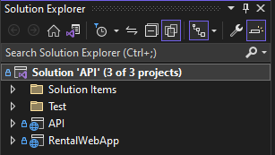
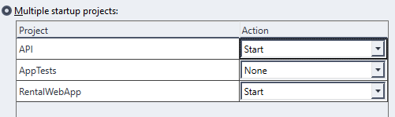
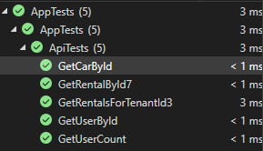

# Rent a Car App - Software Engineering & Testing
+ [Installing](#install) &#9989;
    - [Project Setup](#project-setup)
    - [Running Tests](#tests)
+ [Run App](#run-app)
    - [Known Issues - Check Before Running](#known-issues)
## Install 
1. Install [Visual Studio 2022](https://visualstudio.microsoft.com/thank-you-downloading-visual-studio/?sku=Community&channel=Release&version=VS2022&source=VSLandingPage&cid=2030&passive=false).
2. Install project by clicking 
3. Download ZIP
4. Unzip downloaded zip
5. Go into unzipped folder and double click **API.sln**

## Project Setup

1.  Go into the **Solution Explorer** on the right

2. Right-click **Solution 'API' (3 of 3 projects)**
3. Click **Set Startup Projects** towards the middle 

4. Set the checkbox to **Multiple startup projects**
5. Set **API** and **RentalWebApp** to **Start** and leave AppTests as None 

6. Click OK then click **CTRL + SHIFT + B** to build solution
7. If build is successful, everything **should** work!

## Tests
1. At the top of Visual Studio in the toolbar, you should see **Test**
2. Click **Test** then **Test Explorer**
3. Click the **Left most run button** - Hovering over it should say *Run all Tests in View*
4. Folding out AppTests will provide you with each test ran.

## Run App
*Refreshing by F5 or clicking refresh on browser will reset your userid*
1. Click **Start** towards the top of the screen in Visual Studio
2. An API service and website prompting you to **Select a user**
3. The API has to run in the background, you can run the GET requests in it to see data PS: **DO NOT X OUT ANY WINDOW** it will stop the webapp
4. Explore the website, add cars to the listings, rent cars that you dont own and see the rental history for your user.

## Known Issues
+ Refreshing by F5 or clicking refresh on browser will reset your userid and prompt your to re-select a user
+ Changing between the different tabs(Select user, Add car, Cars, Rental History) after changing user will sometimes show previous users data
**Temp FIX:** *Click any other element on the nav bar and go back will refresh the id to the correct one*